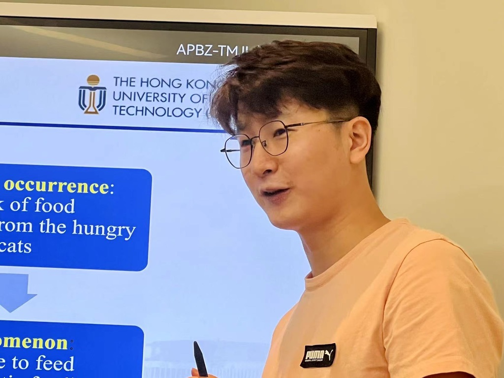

<!-- 设置分栏的方法来自于：https://www.v2ex.com/t/132636 
设置图片边框：https://blog.csdn.net/ProgramChangesWorld/article/details/51702679
-->

<!-- ########################################################################## -->

# <small> Ming YAN | 延 鸣 </small> 

    

        <a href="mailto:wgeng252@connect.hkust-gz.edu.cn">ming.yan (at) polimi (dot) it</a>
        <!--  
        <a href="https://github.com/MingYan54" >
        <i class="fa fa-github"> </i> -->
        <!-- </a>
        <a href=" https://www.linkedin.com/in/rowangw/" >
        <i class="fa fa-linkedin" aria-hidden="true"></i>
        </a>
        <a href="https://twitter.com/Rowan_GW" >
        <i class="fa fa-twitter"> </i> -->
        </a>
     
    

    

        
    

   

I am currently (2023-08-11) a Ph.D. candidate in [Politecnico di Milano](https://www.polimi.it/) under the supervision of Prof. [xxx](link). My research interests include a, b, and c.

Ming Yan is a designer and Ph.D. candidate in Design at [Politecnico di Milano](https://www.polimi.it/) (Italy) under the supervision of Prof. [Lucia Rampino](https://dipartimentodesign.polimi.it/it/staff/show/136317) and Prof. [Giandomenico Caruso](https://caruso.faculty.polimi.it/).

Her core field of research is product and interaction design, focusing on theories of HMI in autonomous vehicles and the nature of design processes, particularly as they pertain to product innovation and creativity. Her Ph.D. research topic in this area is "User acceptance implications for Human-Machine Interfaces in shared autonomous vehicles——Study of HMI for automated shuttle buses through VR prototyping and evaluation."

Since 2013, her attention has concentrated on the opportunities that smarts and interactive artifacts offer for creating an engaging user experience. Specific research topics she has addressed in this field are Aesthetics of Interaction, Product's Multi-Sensory Language, Tangible Interaction, and Design for Behaviour Change. She has published widely on these topics in both Chinese and English.

   

## <small>Research interests</small>

- HMI: xxxx
- HCI: xxxx

----

## <small>Working and Education Experience</small>

- Polimi
- Tongji
- SDU

----

## <small>Funding and awards</small>

- some awards

----

## <small>Hobbies</small>

- Chinese Calligraphy
- Photography
- Traveling

----

## <small>Publications</small>

